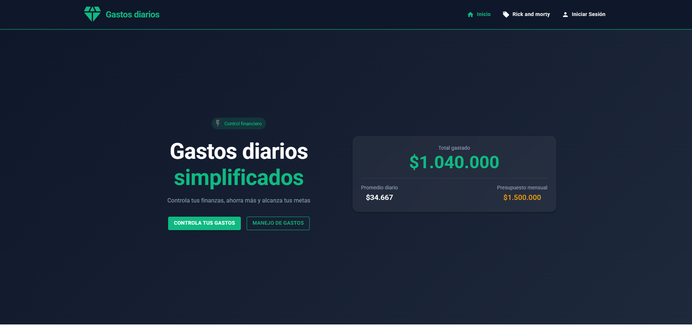
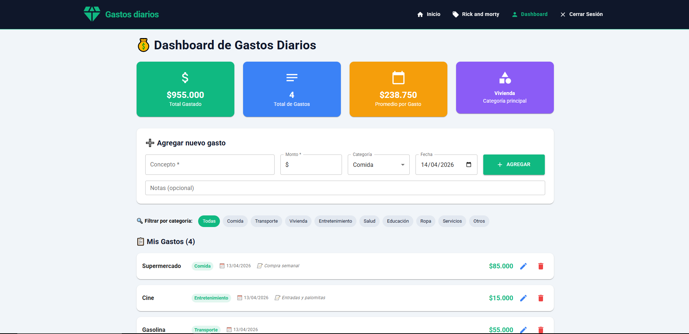

# 💰 Gestor de Gastos Diarios 

Gestor de Gastos Diarios es una aplicación web moderna y sofisticada diseñada para revolucionar la forma en que las personas manejan sus finanzas personales. Desarrollada con React y Material UI, esta plataforma combina una estética visual premium con funcionalidades prácticas que permiten a los usuarios tomar control absoluto de sus hábitos de gasto.

<h1>🌟 Características Principales - Gestor de Gastos Diarios</h1>

📊 Dashboard - Panel de Control (Integrado)
Funcionalidad	Estado
➕ Agregar gastos	✅ Completado
✏️ Editar gastos	✅ Completado
🗑️ Eliminar gastos	✅ Completado
📈 Estadísticas en tiempo real	✅ Completado
🏷️ Filtro por categoría	✅ Completado
📱 Modal de edición	✅ Completado
🔔 Notificaciones visuales	✅ Completado

<h1>🌟 🚀 Instalación y Configuración - Gestor de Gastos Diarios</h1>

📋 Requisitos Previos
Antes de comenzar, asegúrate de tener instalado lo siguiente:

Requisito	Versión	Comando para verificar
Node.js	v18 o superior	node --version
npm	v9 o superior	npm --version
Git	Cualquier versión	git --version
💡 Recomendación: Usa NVM para manejar versiones de Node.js

📦 Instalación Paso a Paso
1️⃣ Clonar el Repositorio
bash
# Clonar el proyecto
git clone https://github.com/tuusuario/gastos-diarios-app.git

# Entrar al directorio del proyecto
cd gastos-diarios-app/TALLER4
2️⃣ Estructura del Proyecto
text
TALLER4/
├── backend/          # API REST (Node.js + Express)
└── frontend/         # Aplicación React (Vite)
🎨 Instalación del Frontend
3️⃣ Instalar dependencias del Frontend
bash
# Navegar al directorio del frontend
cd frontend

# Instalar todas las dependencias
npm install
4️⃣ Dependencias que se instalarán
Paquete	Versión	Descripción
react	^18.2.0	Biblioteca principal
react-dom	^18.2.0	Renderizado de React
react-router-dom	^6.14.0	Navegación entre páginas
@mui/material	^5.14.0	Componentes de UI
@mui/icons-material	^5.14.0	Íconos de Material Design
@emotion/react	^11.11.0	Estilos en CSS-in-JS
@emotion/styled	^11.11.0	Componentes estilizados
axios	^1.4.0	Peticiones HTTP
vite	^4.4.0	Build tool y dev server
5️⃣ Configuración del Frontend
El proyecto usa Vite como build tool. La configuración viene predefinida en vite.config.js:

javascript
// vite.config.js (ya configurado)
import { defineConfig } from 'vite'
import react from '@vitejs/plugin-react'

export default defineConfig({
  plugins: [react()],
  server: {
    port: 5173,
    open: true
  }
})
6️⃣ Ejecutar el Frontend
bash
# Modo desarrollo
npm run dev

# El frontend estará disponible en:
# ➜ Local:   http://localhost:5173/
# ➜ Network: http://192.168.x.x:5173/
7️⃣ Comandos disponibles del Frontend
bash
# Iniciar servidor de desarrollo
npm run dev

# Construir para producción
npm run build

# Vista previa de la build
npm run preview

# Ejecutar linter
npm run lint
⚙️ Instalación del Backend (Opcional)
⚠️ Nota: El dashboard actualmente trabaja con datos locales. El backend es opcional para la funcionalidad básica.

8️⃣ Instalar dependencias del Backend
bash
# Volver al directorio raíz y entrar al backend
cd ../backend

# Instalar dependencias
npm install
9️⃣ Dependencias del Backend
Paquete	Versión	Descripción
express	^4.18.0	Framework web
mongoose	^7.4.0	ODM para MongoDB
dotenv	^16.3.0	Variables de entorno
cors	^2.8.5	Middleware CORS
bcryptjs	^2.4.3	Encriptación de contraseñas
jsonwebtoken	^9.0.0	Autenticación JWT
nodemon	^3.0.0	Recarga automática (dev)
🔟 Configurar Variables de Entorno
bash
# Crear archivo .env en la raíz del backend
touch .env
Contenido del archivo .env:

env
# Puerto del servidor
PORT=3000

# URL de MongoDB
MONGODB_URI=mongodb://localhost:27017/gastos_db

# Secreto para JWT
JWT_SECRET=tu_secreto_super_seguro_aqui

# Entorno
NODE_ENV=development
1️⃣1️⃣ Ejecutar el Backend
bash
# Modo desarrollo (con nodemon)
npm run dev

# Modo producción
npm start

# El backend estará disponible en:
# ➜ http://localhost:3000

<h1>🌟 🛠️ Tecnologías del Proyecto - Gestor de Gastos Diarios</h1>

📊 Stack Tecnológico Completo
Capa	Tecnologías
Frontend	React 18 + Vite + Material UI
Backend	Node.js + Express + MongoDB
Estilos	Material UI + Emotion + CSS-in-JS
Estado	React Hooks (useState, useEffect)
Rutas	React Router DOM v6

🎨 Frontend
Core Framework
Tecnología	Versión	Ícono	Propósito
React	18.2.0	⚛️	Biblioteca principal para UI
React DOM	18.2.0	🌐	Renderizado en el navegador
Vite	4.4.0	⚡	Build tool y servidor de desarrollo

UI y Estilos
Tecnología	Versión	Ícono	Propósito
Material UI (MUI)	5.14.0	🎨	Componentes de interfaz
MUI Icons	5.14.0	🔣	Biblioteca de íconos
Emotion	11.11.0	💅	CSS-in-JS para estilos
MUI System	5.14.0	📐	Sistema de diseño y grid

```bash
TALLER4/
├── backend/
│   ├── node_modules/
│   ├── src/
│   │   ├── models/
│   │   │   └── user.js
│   │   └── routes/
│   │       ├── auth.js
│   │       └── app.js
│   ├── .env
│   ├── package-lock.json
│   └── package.json
│
├── frontend/
│   ├── node_modules/
│   ├── public/
│   ├── src/
│   │   ├── features/
│   │   │   ├── api/
│   │   │   │   └── rickandmorty.jsx
│   │   │   ├── auth/
│   │   │   │   └── Components/
│   │   │   │       ├── Login.jsx
│   │   │   │       └── Register.jsx
│   │   │   ├── hooks/
│   │   │   │   └── useAccount.jsx
│   │   │   ├── dashboard/
│   │   │   │   └── Dashboard.jsx
│   │   │   └── layout/
│   │   │       └── components/
│   │   │           ├── Content.jsx
│   │   │           ├── Footer.jsx
│   │   │           └── Header.jsx
│   │   ├── shared/
│   │   │   └── styles/
│   │   │       └── index.css
│   │   ├── App.jsx
│   │   ├── main.jsx
│   │   └── routes.jsx
│   ├── eslint.config.js
│   ├── index.html
│   ├── package-lock.json
│   ├── package.json
│   ├── vite.config.js
│   └── README.md
```




<h1>🌟 👤 Autor</h1>

**Nombre:** Axebiel Jair Galvis Alaña 
 
**Correo:** axebielgalvis@gmail.com  

---

## 📌 Información del Proyecto

**Nombre:** TALLER4 - Gestion de gasts
**Descripción:** gestion de gastos de un individuo. 
**Tecnologías:** React, Node.js, Express, etc.  
**Año:** 2026   